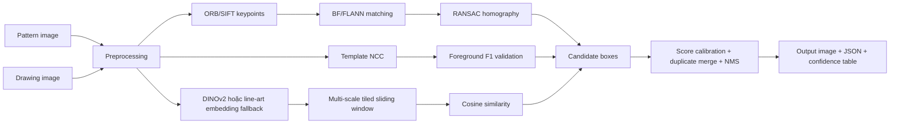

# Zero-Shot Pattern Detection cho bản vẽ kỹ thuật BOM

Đây là repository xây dựng hệ thống phát hiện pattern trong bản vẽ kỹ thuật theo cơ chế zero-shot. Người dùng chỉ cần cung cấp:

- `pattern image`: ảnh query pattern cần tìm
- `drawing image`: ảnh bản vẽ kỹ thuật đầy đủ

Hệ thống trả về:

- toàn bộ bounding box chứa pattern
- confidence score cho từng bounding box
- ảnh visualization đã vẽ bbox
- JSON kết quả để tích hợp vào pipeline khác

Điểm quan trọng: hệ thống không cần retrain khi đổi pattern mới, không hardcode pattern, và có thể dùng trực tiếp với các ký hiệu kỹ thuật khác nhau trong bản vẽ grayscale/binary/scan.

## Trạng thái hiện tại

Repository đã có sẵn bộ bản vẽ thật trong thư mục `drawing/` và các query image đã trích xuất trong:

```text
drawing/query_images/
|-- drawing_01_bridge_rectifier_query.png
|-- drawing_02_xor_gate_query.png
|-- drawing_03_fuse_query.png
|-- drawing_04_opamp_query.png
|-- drawing_05_push_button_query.png
|-- drawing_06_led_query.png
`-- manifest.json
```

Kết quả verify hiện tại:

| Drawing | Query pattern | Detections |
|---|---:|---:|
| `drawing/1.png` | bridge rectifier | 2 |
| `drawing/2.png` | XOR gate | 1 |
| `drawing/3.png` | fuse | 3 |
| `drawing/4.png` | op-amp | 1 |
| `drawing/5.png` | push button | 2 |
| `drawing/6.png` | LED | 6 |

File summary verify:

```text
outputs/query_image_verification/query_image_verification.json
```

Ảnh render bbox sau verify nằm tại:

```text
outputs/query_image_verification/
```

## Kiến trúc pipeline



Pipeline gồm 4 nhánh chính:

1. **Classical feature matching**
   - ORB
   - SIFT
   - BFMatcher / FLANN
   - Lowe ratio test
   - Homography verification bằng RANSAC

2. **Template matching cho line-art**
   - Normalized cross-correlation
   - Foreground mask
   - Foreground F1 validation để giảm false positive
   - Multi-scale và rotation variants

3. **Deep feature similarity**
   - DINOv2 nếu model có cache hoặc được bật rõ ràng
   - fallback line-art embedding bằng HOG/projection/edge
   - cosine similarity
   - tiled sliding-window cho ảnh lớn

4. **Post-processing**
   - threshold filtering
   - confidence calibration
   - duplicate merge
   - Non-Max Suppression
   - JSON export và visualization

## Cấu trúc thư mục

```text
project_root/
|-- app/
|   |-- main.py
|   |-- gradio_app.py
|   |-- inference.py
|   |-- preprocess.py
|   |-- configs/
|   |-- feature_extractors/
|   |-- matching/
|   |-- postprocess/
|   |-- visualization/
|   |-- utils/
|   `-- models/
|-- drawing/
|   |-- 1.png
|   |-- 2.png
|   |-- ...
|   `-- query_images/
|-- tools/
|   |-- extract_query_images.py
|   `-- verify_query_images.py
|-- benchmark/
|-- examples/
|-- outputs/
|-- docs/
|-- tests/
|-- requirements.txt
|-- Dockerfile
|-- README.md
`-- design_specification.md
```

## Cài đặt

```bash
git clone <your-repo-url>
cd <repo>

python -m venv .venv
source .venv/bin/activate  # Windows: .venv\Scripts\activate

pip install -r requirements.txt
```

Sinh lại ảnh ví dụ synthetic nếu cần:

```bash
python -m benchmark.generate_synthetic --output-dir examples
```

## Chạy inference bằng CLI

Ví dụ với drawing 1:

```bash
python -m app.main \
  --pattern drawing/query_images/drawing_01_bridge_rectifier_query.png \
  --drawing drawing/1.png \
  --output-dir outputs \
  --prefix drawing_01_result
```

Kết quả:

```text
outputs/drawing_01_result.png
outputs/drawing_01_result.json
```

Tắt deep scan để chạy nhanh hơn khi template/classical đã đủ tốt:

```bash
python -m app.main \
  --pattern drawing/query_images/drawing_03_fuse_query.png \
  --drawing drawing/3.png \
  --output-dir outputs \
  --prefix drawing_03_fast \
  --no-deep
```

## Chạy Gradio app

```bash
python -m app.gradio_app
```

Mở:

```text
http://127.0.0.1:7860
```

Giao diện hỗ trợ:

- upload pattern image
- upload drawing image
- bật/tắt ORB/SIFT homography
- bật/tắt line-art template matching
- bật/tắt deep/fallback similarity
- xem output image
- xem bbox JSON
- xem confidence table

## Trích xuất lại query images từ drawing

Script:

```bash
python tools/extract_query_images.py \
  --drawing-dir drawing \
  --output-dir drawing/query_images \
  --contact-sheet outputs/query_images_contact_sheet.png
```

Output:

```text
drawing/query_images/*.png
drawing/query_images/manifest.json
outputs/query_images_contact_sheet.png
```

`manifest.json` lưu crop box `xyxy` cho từng query image.

## Verify query images

Chạy verify toàn bộ query image với drawing tương ứng:

```bash
python tools/verify_query_images.py \
  --drawing-dir drawing \
  --query-dir drawing/query_images \
  --output-dir outputs/query_image_verification
```

Output:

```text
outputs/query_image_verification/query_image_verification.json
outputs/query_image_verification/*.png
```

## Benchmark

```bash
python -m benchmark.benchmark \
  --pattern examples/pattern_flange.png \
  --drawing examples/drawing_flange.png \
  --ground-truth examples/ground_truth_flange.json
```

Benchmark trả về:

- wall time
- timing từng stage
- Precision
- Recall
- F1
- mean IoU

## Docker

```bash
docker build -t zero-shot-pattern-detector .
docker run --rm -p 7860:7860 zero-shot-pattern-detector
```

## HuggingFace Spaces

Repository đã có metadata Gradio Space ở đầu README:

```yaml
sdk: gradio
app_file: app/gradio_app.py
```

Deploy:

1. Tạo HuggingFace Space mới với SDK `Gradio`.
2. Push toàn bộ repository lên Space.
3. Space sẽ chạy entrypoint `app/gradio_app.py`.
4. Với CPU Space, nên để DINOv2 tắt nếu chưa cache model.

## Config quan trọng

Config mặc định:

```text
app/configs/default.yaml
```

Các tham số hay chỉnh:

- `preprocess.max_image_side`: giới hạn kích thước ảnh khi xử lý CPU
- `classical.min_inliers`: số inlier tối thiểu cho homography
- `template.threshold`: ngưỡng NCC thô
- `template.min_foreground_f1`: ngưỡng xác thực foreground overlap
- `template.min_combined_score`: ngưỡng score cuối của template matcher
- `deep.scales`: danh sách scale cho deep sliding window
- `deep.max_windows`: giới hạn số window
- `postprocess.score_threshold`: ngưỡng confidence sau matcher
- `postprocess.nms_iou_threshold`: IoU threshold cho NMS
- `inference.skip_deep_if_candidates`: bỏ qua deep scan nếu template/classical đã có candidate tốt

## Khi nào dùng từng matcher?

| Matcher | Phù hợp với | Điểm mạnh | Hạn chế |
|---|---|---|---|
| ORB/SIFT + RANSAC | pattern có nhiều keypoint | chính xác, có geometric verification | dễ miss với symbol quá đơn giản |
| Template NCC + F1 | ký hiệu line-art, binary, nét mảnh | rất tốt cho bản vẽ kỹ thuật | nhạy với crop quá nhiều dây/chữ |
| DINOv2 / fallback embedding | pattern biến dạng hoặc scan noise | tổng quát hơn | chậm hơn trên CPU |

## Hạn chế hiện tại

- Query crop quá rộng, dính nhiều chữ hoặc dây nối có thể làm giảm recall.
- Rotation góc bất kỳ cần thêm angle vào config, runtime sẽ tăng.
- DINOv2 cần model cache hoặc quyền tải model lần đầu.
- Với bản vẽ rất lớn, cần tune `max_image_side`, `tile_size`, `max_windows`.

## Hướng cải thiện

- Thêm UI crop trực tiếp pattern từ drawing trong Gradio.
- Thêm auto proposal bằng contour để giảm số sliding window.
- Thêm ONNX Runtime backend cho DINOv2.
- Thêm rotated bounding box hoặc polygon output.
- Thêm bộ validation thực tế để calibrate confidence theo domain.
