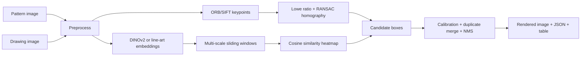

# Zero-Shot Pattern Detection for Technical BOM Drawings

This repository implements a production-oriented zero-shot pattern detector for grayscale, binary, and scanned engineering drawings. It accepts a query pattern image and a full drawing image, then returns all matching bounding boxes with confidence scores.

The system does not retrain when the pattern changes. It combines classical local feature matching with deep or fallback feature similarity, then consolidates detections with confidence calibration and non-max suppression.

## Repository Tree

```text
project_root/
├── app/
│   ├── main.py
│   ├── gradio_app.py
│   ├── inference.py
│   ├── preprocess.py
│   ├── configs/
│   ├── feature_extractors/
│   ├── matching/
│   ├── postprocess/
│   ├── visualization/
│   ├── utils/
│   └── models/
├── benchmark/
├── examples/
├── outputs/
├── docs/
├── tests/
├── assets/
├── requirements.txt
├── Dockerfile
├── README.md
└── design_specification.md
```

## Architecture



## Key Features

- Zero-shot query pattern search with no retraining.
- Works with grayscale, binary, and noisy scanned line-art drawings.
- Supports multiple occurrences, scale variation, and 0/90/180/270 rotation by default.
- Classical path: ORB, SIFT, BFMatcher, Lowe ratio test, homography verification, iterative RANSAC for multiple instances.
- Similarity path: DINOv2 lazy-load when cached or explicitly enabled; deterministic line-art HOG/projection fallback for offline CPU inference.
- CPU-friendly controls: max side resize, sliding-window cap, batched embedding, threshold config.
- Production utilities: typed config, logging, CLI, Gradio UI, benchmark, evaluation metrics, Dockerfile, ONNX export helper.

## Installation

```bash
git clone <your-repo-url>
cd <repo>
python -m venv .venv
source .venv/bin/activate  # Windows: .venv\Scripts\activate
pip install -r requirements.txt
python -m benchmark.generate_synthetic --output-dir examples
```

## Run CLI Inference

```bash
python -m app.main \
  --pattern examples/pattern_flange.png \
  --drawing examples/drawing_flange.png \
  --output-dir outputs \
  --prefix flange_demo
```

Outputs:

- `outputs/flange_demo.png`: drawing rendered with detections.
- `outputs/flange_demo.json`: bounding boxes, scores, source matcher, timings.

Enable DINOv2 if the model is already cached:

```bash
python -m app.main --pattern examples/pattern_flange.png --drawing examples/drawing_flange.png --use-dino
```

Allow torch hub to download DINOv2 weights:

```bash
ZD_ALLOW_DINO_DOWNLOAD=1 python -m app.main \
  --pattern examples/pattern_flange.png \
  --drawing examples/drawing_flange.png \
  --use-dino --allow-dino-download
```

## Run Gradio Demo

```bash
python -m app.gradio_app
```

Open `http://127.0.0.1:7860`, upload a pattern and drawing, then run inference. The UI returns the rendered image, JSON detections, and a confidence table.

## HuggingFace Spaces Deployment

1. Create a new Space with SDK `Gradio`.
2. Push this repository.
3. Keep `app_file: app/gradio_app.py` in the README metadata.
4. For offline CPU Spaces, leave DINO disabled in the UI. For DINOv2, use persistent cache or set `ZD_ALLOW_DINO_DOWNLOAD=1`.

## Docker

```bash
docker build -t zero-shot-pattern-detector .
docker run --rm -p 7860:7860 zero-shot-pattern-detector
```

## Benchmark

```bash
python -m benchmark.benchmark \
  --pattern examples/pattern_flange.png \
  --drawing examples/drawing_flange.png \
  --ground-truth examples/ground_truth_flange.json
```

The benchmark writes `outputs/benchmark.json` with wall time, pipeline timings, Precision, Recall, F1, and mean IoU.

## Tests

```bash
pytest
```

## Configuration

Default thresholds live in `app/configs/default.yaml`.

Important knobs:

- `preprocess.max_image_side`: upper bound for CPU processing.
- `classical.min_inliers`: minimum RANSAC inliers per homography.
- `deep.max_windows`: cap for sliding-window candidates.
- `deep.tile_size` and `deep.tile_overlap_ratio`: tiled scan controls for large drawings.
- `deep.similarity_threshold`: raw cosine threshold before post-processing.
- `postprocess.nms_iou_threshold`: duplicate suppression aggressiveness.
- `postprocess.max_detections`: final result cap.

## Limitations

- Arbitrary small-angle rotation is handled best by DINO/fallback similarity plus configured rotation variants. Add more angles for difficult drawings at the cost of runtime.
- Very low-texture symbols can have few SIFT/ORB keypoints, so the deep/fallback path is important.
- DINOv2 needs weights in the local torch hub cache or network permission for first download.
- Sliding-window recall depends on step size and scale list. Smaller steps improve recall but increase CPU time.

## Future Improvements

- Add learned line-art descriptor distillation for faster CPU embeddings.
- Add contour-based proposal generation to reduce sliding-window count.
- Add ONNX Runtime backend for DINOv2 embeddings.
- Add angle regression or Fourier-Mellin pre-alignment for arbitrary rotations.
- Add dataset adapters for BOM-specific annotation formats.
